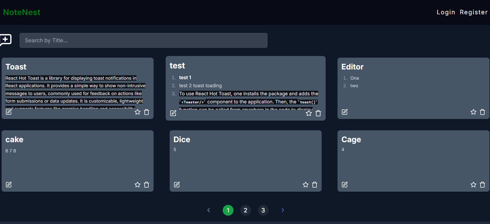

# 📌 Project Title

**SmartNote** — Effortless Note-Taking with Rich Text Editing, Authentication, and Fullstack Power!


SmartNotes is a full-stack note-taking web application that lets you securely create, edit, and manage notes with rich text formatting. Built using Next.js, MongoDB, and Tailwind CSS, it features Google Authentication and persistent user-specific notes.

✨ Whether you're journaling, organizing ideas, or creating to-do lists — SmartNotes has you covered.


## ✨ Features


- 📝 Rich Text Editor with formatting (bold, italic, underline, lists, links)

- 🔐 Secure Authentication with Google (via NextAuth.js)

- 📁 User-specific Notes — notes are private and tied to your login

- 🌐 Fully Responsive UI built with Tailwind CSS

- ⚡ Next.js App Router & server actions

- ☁️ MongoDB Atlas integration for persistent note storage

- 🔄 Live Note Preview while editing


## 🚀 Live Demo:

 [NoteNest](https://smart-notes-three-omega.vercel.app/login)


## 🔧 Tech Stack

- 🚀 Framework: [Next.js 14 (App Router)]
- 💅 Styling: Tailwind CSS
- 🔐 Auth: NextAuth.js (with Google provider)
- 📦 Database: MongoDB Atlas
- 📝 Editor: ReactQuill (Rich Text Editor)
- ⚡ Notifications: react-hot-toast


## 🧠 How It Works
- Users log in with Google

- A MongoDB entry is created (if not already)

- Notes are stored with ownerEmail to isolate user data

- React-Quill provides a beautiful and intuitive editing experience

- Full responsiveness ensures usability on mobile, tablet, and desktop
##  Getting Started

# 1. Clone the repository

```bash
  git clone https://github.com/Yash531548/SmartNotes.git
  cd SmartNotes
```
# 2. Install dependencies
```bash
npm install
```

# 3. Setup environment variables

Create a `.env` file with the following:
```js
NEXTAUTH_URL=http://localhost:3000
GOOGLE_CLIENT_ID=your-google-client-id
GOOGLE_CLIENT_SECRET=your-google-client-secret
NEXTAUTH_SECRET=your-nextauth-secret
MONGODB_URI=your-mongodb-uri
```
# 4. Run the app
```bash 
npm run dev
```


## Screenshots
### User View


### Note Popup View

### Add Note

### Login 


## 🙌 Contributing

Pull requests are welcome! For major changes, please open an issue first to discuss what you would like to change.
